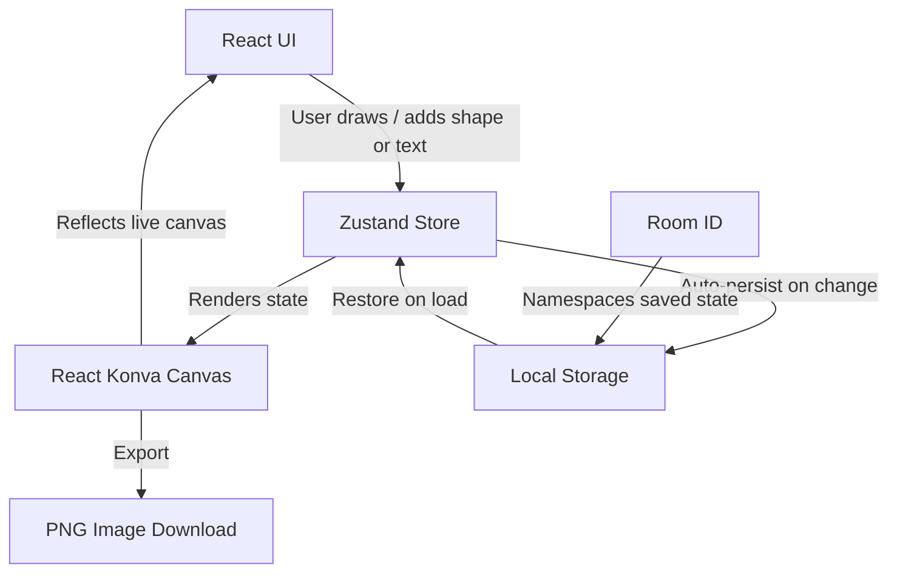
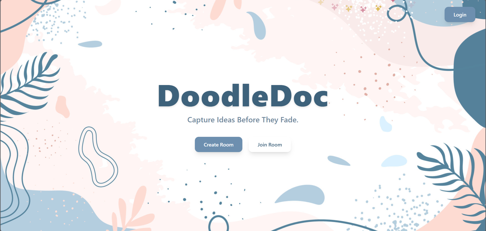
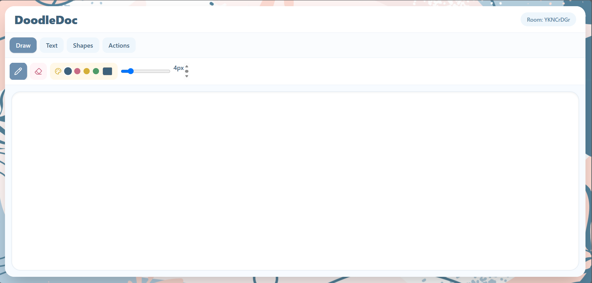
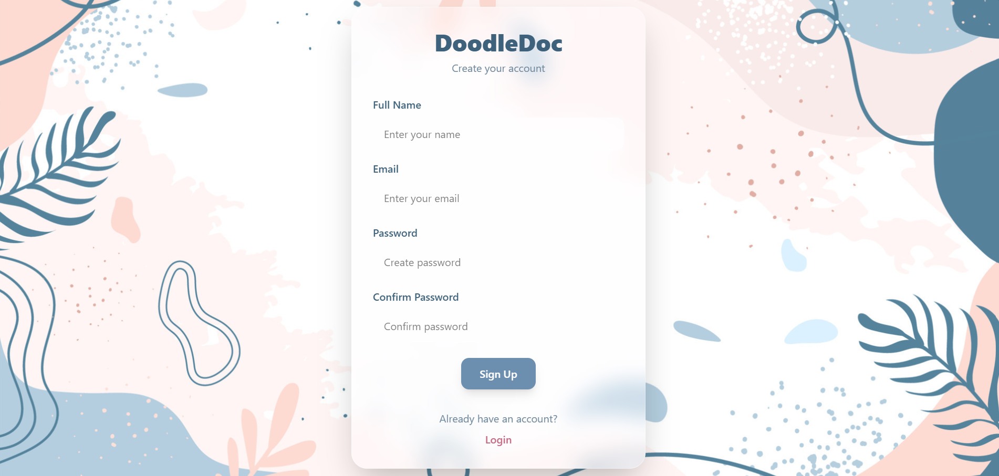
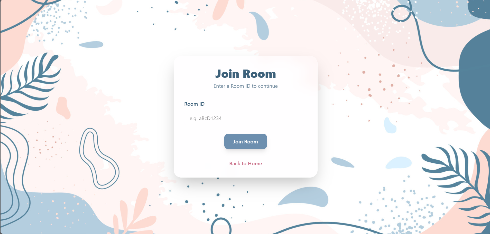

# 🎨 DoodleDoc

<p align="center">
  <em>A feature-rich online whiteboard for drawing, shapes, formatted text, and image export — built with React, Konva, Zustand, and Tailwind CSS.</em>
</p>

<p align="center">
  
  
  
  
  
  
  
</p>

<p align="center">
  
</p>

---

## Live Demo

**[https://doodle-doc.vercel.app/](https://doodle-doc.vercel.app/)**

---

## About

**DoodleDoc** is a browser-based whiteboard application that brings freehand drawing, shape tools, and rich text editing into a single canvas workspace. Built on **React Konva** for canvas rendering and **Zustand** for lightweight, predictable state management, it supports room-based whiteboards with automatic Local Storage persistence — so a session's work survives a page refresh without needing a backend.

---

## Features

### Drawing Tools

| Feature | Status |
|----------|--------|
| Pen Tool | ✅ |
| Eraser Tool | ✅ |
| Adjustable Brush Size | ✅ |
| Custom Color Picker | ✅ |

### Shapes

| Shape | Status |
|--------|--------|
| Rectangle | ✅ |
| Circle | ✅ |
| Diamond | ✅ |
| Line | ✅ |
| Arrow | ✅ |

### Text Editing

| Feature | Status |
|----------|--------|
| Add Text Anywhere on Canvas | ✅ |
| Edit Existing Text | ✅ |
| Font Family Selection | ✅ |
| Font Size Selection | ✅ |
| Bold / Italic / Underline | ✅ |

### Shape Manipulation

| Feature | Status |
|----------|--------|
| Drag and Move Shapes | ✅ |
| Resize via Handles | ✅ |
| Select and Edit Objects | ✅ |

### Actions & Persistence

| Feature | Status |
|----------|--------|
| Undo / Redo | ✅ |
| Delete Selected Shape/Text | ✅ |
| Export Whiteboard as Image | ✅ |
| Room-Based Whiteboards | ✅ |
| Unique Room IDs | ✅ |
| Copy Room ID (One Click) | ✅ |
| Auto-Save via Local Storage | ✅ |
| State Restored on Refresh | ✅ |

---

## Tech Stack

| Layer | Technology |
|--------|------------|
| Framework | React.js |
| Canvas Engine | React Konva |
| State Management | Zustand |
| Styling | Tailwind CSS |
| Icons | Lucide React |
| Persistence | Local Storage API |
| Deployment | Vercel |

---

## Application Flow



---

## Screenshots

### Home Page


### Drawing Canvas


### Login Page


---

### Signup Page


---

### Join Room Page


---

## Installation

Clone the repository:

```bash
git clone https://github.com/Radhikagupta25/DoodleDoc.git
```

Navigate to the project:

```bash
cd doodledoc
```

Install dependencies:

```bash
npm install
```

Run the development server:

```bash
npm run dev
```

---

## Project Structure

```text
src/
│
├── components/
│   └── Canvas.jsx
│
├── pages/
│   ├── Home.jsx
│   └── Room.jsx
│
├── store/
│   └── useWhiteboardStore.js
│
├── assets/
│
└── App.jsx
```

---

## Learning Outcomes

While building DoodleDoc, I explored:

* Canvas-based drawing with React Konva
* State management using Zustand
* Shape rendering and transformations
* Undo/Redo implementation using history stacks
* Local Storage persistence
* Dynamic text editing
* Event handling and canvas interactions
* Exporting canvas content as images

---

## Future Improvements

- [ ] Real-time collaboration
- [ ] Multi-user rooms
- [ ] Firebase / Socket.IO integration
- [ ] Export as PDF
- [ ] Dark mode
- [ ] Shape color customization
- [ ] Custom shape library
- [ ] Infinite canvas

---

## Author

**Radhika Gupta**
B.Tech Computer Science
Ajay Kumar Garg Engineering College
GitHub: [`https://github.com/Radhikagupta25`](https://github.com/Radhikagupta25)

---

## If You Like This Project

Consider giving it a star on GitHub!

```bash
⭐ Star the repository
🍴 Fork the repository
🚀 Build upon it
```
